# Screenshoot Soal Nomor 3

## 3.A
### Query Mempersiapkan Tabel
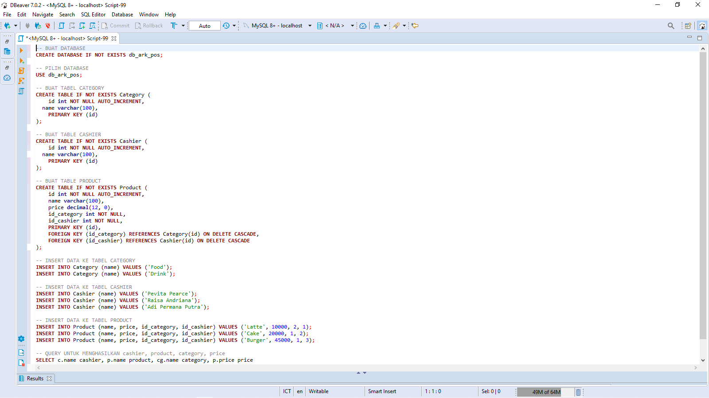
### Hasil Eksekusi Query Mempersiapkan Tabel
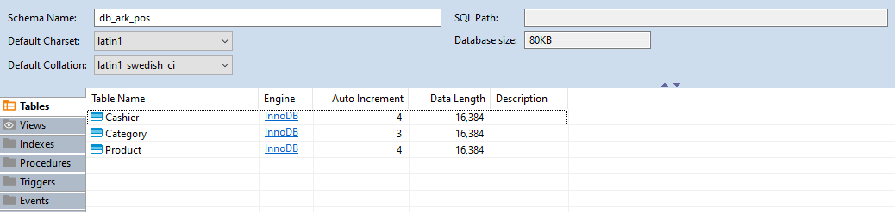
### Query Menghasilan Tampilan cashier, product, category, price
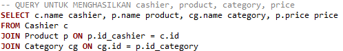
### Hasil Eksekusi Query Menghasilan Tampilan cashier, product, category, price
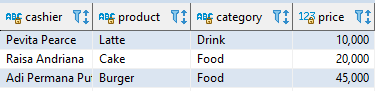

## 3.B
### Tampilan Home
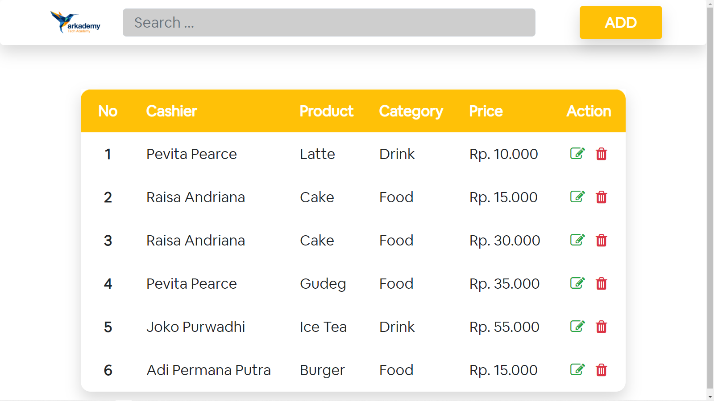
### Tampilan Add
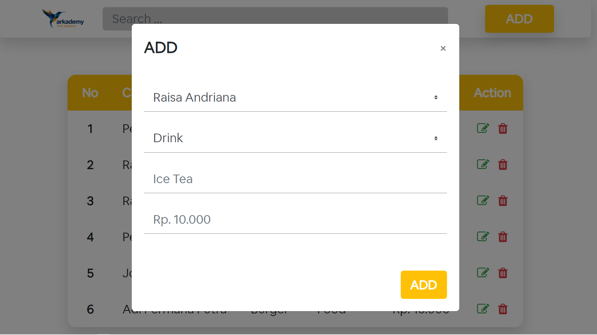
### Tampilan Delete
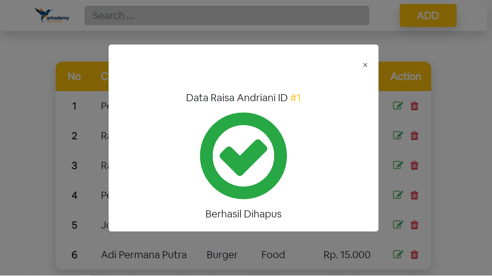
### Tampilan Edit

## 3.C
### Tampilan Home
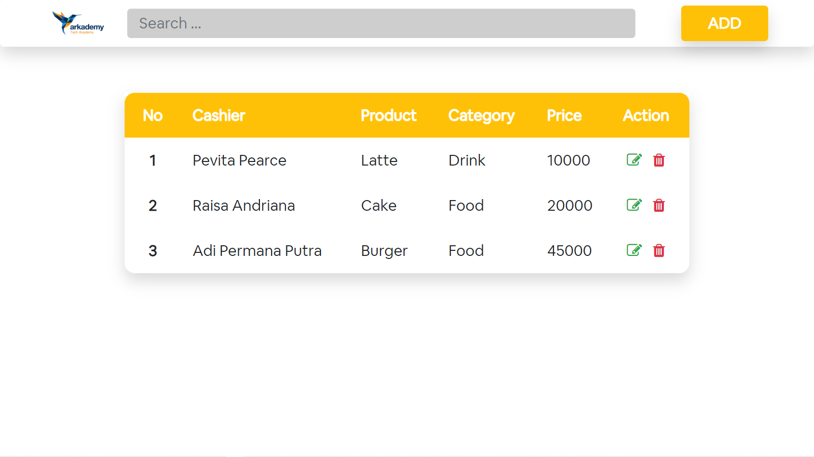
### Tampilan Add
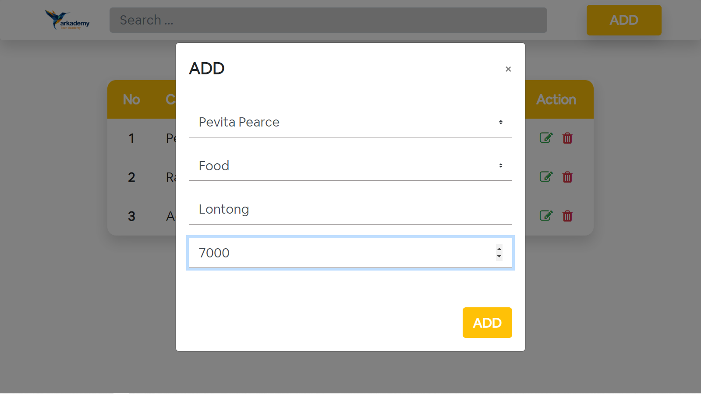
### Tampilan Home Setelah Add
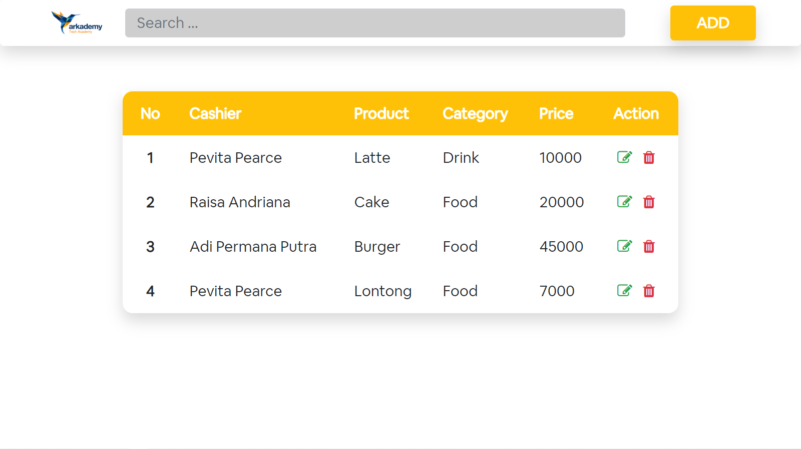
### Tampilan Edit
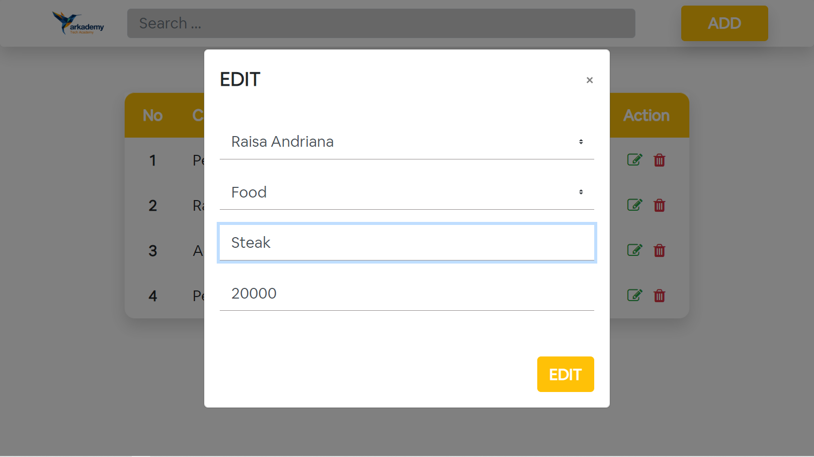
### Tampilan Home Setelah Edit

### Tampilan Delete
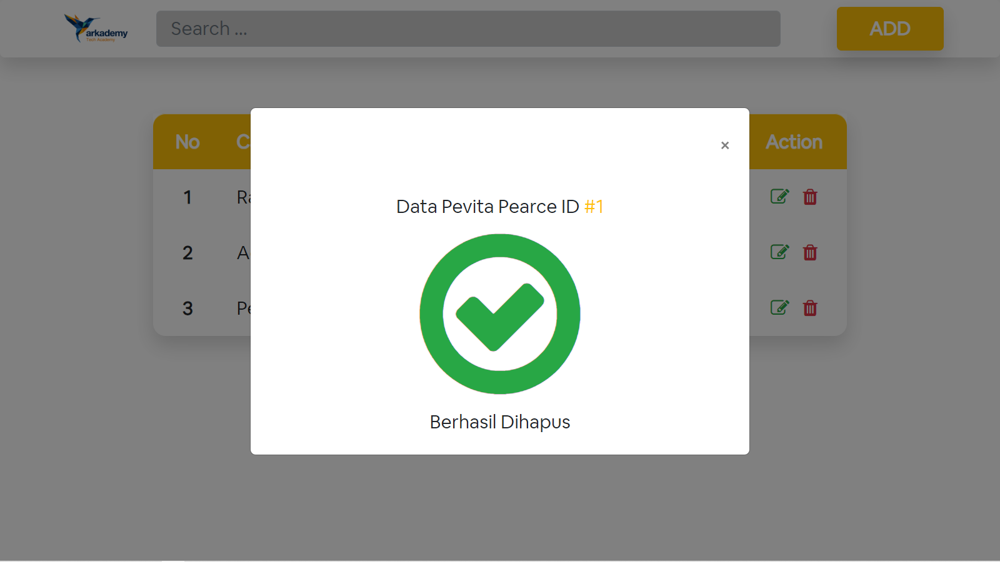
### Tampilan Home Setelah Delete
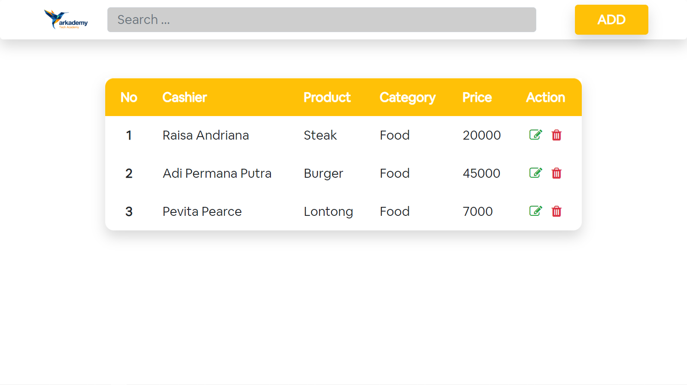